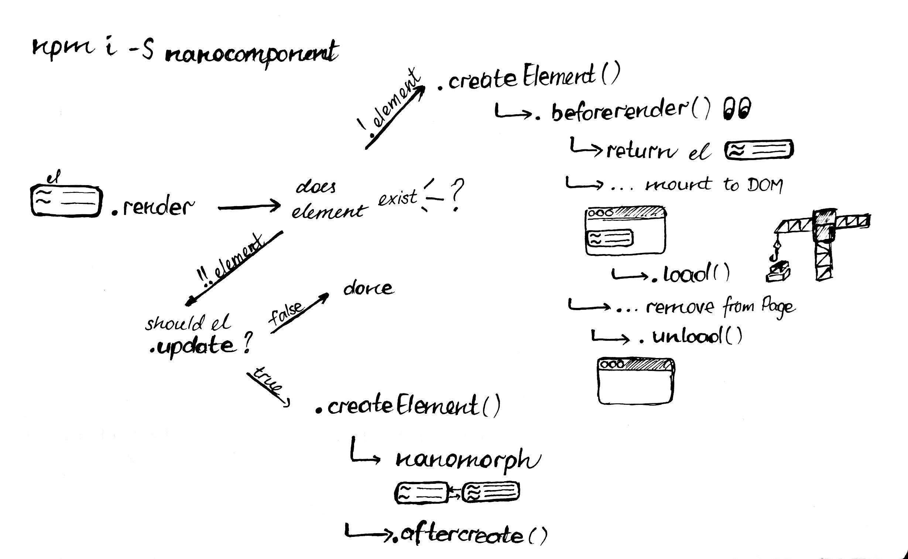

# nanocomponent [![stability][0]][1]

[![npm version][2]][3] [![build status][4]][5]
[![downloads][8]][9] [![js-standard-style][10]][11]

Native DOM components that pair nicely with DOM diffing algorithms.

## Features

- Isolate native DOM libraries from DOM diffing algorithms
- Makes rendering elements _very fast™_ by avoiding unnecessary rendering
- Component nesting and state update passthrough
- Implemented in only a few lines
- Only uses native DOM methods
- Class based components offering a familiar component structure
- Works well with [nanohtml][nanohtml] and [yoyoify][yoyoify]
- Combines the best of `nanocomponent@5` and [`cache-component@5`][cc].

## Usage

```js
// button.js
var Nanocomponent = require('nanocomponent')
var html = require('nanohtml')

class Button extends Nanocomponent {
  constructor () {
    super()
    this.color = null
  }

  createElement (color) {
    this.color = color
    return html`
      <button style="background-color: ${color}">
        Click Me
      </button>
    `
  }

  // Implement conditional rendering
  update (newColor) {
    return newColor !== this.color
  }
}

module.exports = Button
```

```js
// index.js
var choo = require('choo')
var html = require('nanohtml')

var Button = require('./button.js')
var button = new Button()

var app = choo()
app.route('/', mainView)
app.mount('body')

function mainView (state, emit) {
  return html`
    <body>
      ${button.render(state.color)}
    </body>
  `
}

app.use(function (state, emitter) {
  state.color = 'green'
})
```

## Patterns

These are some common patterns you might encounter when writing components.

### Standalone

Nanocomponent is part of the choo ecosystem, but works great standalone!

```js
var Button = require('./button.js')
var button = new Button()

// Attach to DOM
document.body.appendChild(button.render('green'))

// Update mounted component
button.render('green')
button.render('red')

// Log a reference to the mounted dom node
console.log(button.element)
```

### Binding event handlers as component methods

Sometimes it's useful to pass around prototype methods into other functions.
This can be done by binding the method that's going to be passed around:

```js
var Nanocomponent = require('nanocomponent')
var html = require('nanohtml')

class Component extends Nanocomponent {
  constructor () {
    super()

    // Bind the method so it can be passed around
    this.handleClick = this.handleClick.bind(this)
  }

  handleClick (event) {
    console.log('element is', this.element)
  }

  createElement () {
    return html`<button onclick=${this.handleClick}>
      My component
    </button>`
  }

  update () {
    return false // Never re-render
  }
}
```

### ES5 Syntax

Nanocomponent can be written using prototypal inheritance too:

```js
var Nanocomponent = require('nanocomponent')
var html = require('nanohtml')

function Component () {
  if (!(this instanceof Component)) return new Component()
  Nanocomponent.call(this)
  this.color = null
}

Component.prototype = Object.create(Nanocomponent.prototype)

Component.prototype.createElement = function (color) {
  this.color = color
  return html`
    <div style="background-color: ${color}">
      Color is ${color}
    </div>
  `
}

Component.prototype.update = function (newColor) {
  return newColor !== this.color
}
```

### Mutating the components instead of re-rendering

Sometimes you might want to mutate the element that's currently mounted, rather
than performing DOM diffing. Think cases like third party widgets that manage
themselves.

```js
var Nanocomponent = require('nanocomponent')
var html = require('nanohtml')

class Component extends Nanocomponent {
  constructor () {
    super()
    this.text = ''
  }

  createElement (text) {
    this.text = text
    return html`<h1>${text}</h1>`
  }

  update (text) {
    if (text !== this.text) {
      this.text = text
      this.element.innerText = this.text   // Directly update the element
    }
    return false                           // Don't call createElement again
  }

  unload (text) {
    console.log('No longer mounted on the DOM!')
  }
}
```

Please note that if you remove a component from the DOM, it will be unloaded, and when reinserted into the DOM, `createElement` will be fired again. If you want to maintain control of a component's rendering, it has to stay mounted! See [issue #88](https://github.com/choojs/nanocomponent/issues/88) for a more detailed discussion.

### Nested components and component containers

Components nest and can skip renders at intermediary levels.  Components can
also act as containers that shape app data flowing into view specific
components.

```js
var Nanocomponent = require('nanocomponent')
var html = require('nanohtml')
var Button = require('./button.js')

class Component extends Nanocomponent {
  constructor () {
    super()
    this.button1 = new Button()
    this.button2 = new Button()
    this.button3 = new Button()
  }

  createElement (state) {
    var colorArray = shapeData(state)
    return html`
      <div>
        ${this.button1.render(colorArray[0])}
        ${this.button2.render(colorArray[1])}
        ${this.button3.render(colorArray[2])}
      </div>
    `
  }

  update (state) {
    var colorArray = shapeData(state) // process app specific data in a container
    this.button1.render(colorArray[0]) // pass processed data to owned children components
    this.button2.render(colorArray[1])
    this.button3.render(colorArray[2])
    return false // always return false when mounted
  }
}

// Some arbitrary data shaping function
function shapeData (state) {
  return [state.colors.color1, state.colors.color2, state.colors.color3]
}
```

## FAQ

### What order do lifecycle events run in?



**Note:** `aftercreate` should actually say `afterupdate`.

Shoutout to [@lrlna](https://github.com/lrlna) for the excellent diagram.

### Where does this run?

Nanocomponent was written to work well with [choo][choo], but it also works well
with DOM diffing engines that check `.isSameNode()` like [nanomorph][nm] and
[morphdom][md].  It is designed and documented in isolation however, so it also
works well on it's own if you are careful.  You can even embed it in other SPA
frameworks like React or Preact with the use of [nanocomponent-adapters][nca] which
enable framework-free components! 😎

### What's a proxy node?

It's a node that overloads `Node.isSameNode()` to compare it to another node.
This is needed because a given DOM node can only exist in one DOM tree at the
time, so we need a way to reference mounted nodes in the tree without actually
using them. Hence the proxy pattern, and the recently added support for it in
certain diffing engines:

```js
var html = require('nanohtml')

var el1 = html`<div>pink is the best</div>`
var el2 = html`<div>blue is the best</div>`

// let's proxy el1
var proxy = html`<div></div>`
proxy.isSameNode = function (targetNode) {
  return (targetNode === el1)
}

el1.isSameNode(el1)   // true
el1.isSameNode(el2)   // false
proxy.isSameNode(el1) // true
proxy.isSameNode(el2) // false
```

### How does it work?

[`nanomorph`][nm] is a diffing engine that diffs real DOM trees. It runs a series
of checks between nodes to see if they should either be replaced, removed,
updated or reordered. This is done using a series of property checks on the
nodes.

[`nanomorph`][nm] runs `Node.isSameNode(otherNode)` when diffing two DOM trees. This
allows us to override the function and replace it with a custom function that
proxies an existing node. Check out the code to see how it works. The result is
that if every element in our tree uses `nanocomponent`, only elements that have
changed will be recomputed and re-rendered making things very fast.

`nanomorph`, which saw first use in choo 5, has supported `isSameNode` since
its conception. [`morphdom`][md] has supported `.isSameNode` since [v2.1.0][210].

### Is this basically `react-create-class`?

`nanocomponent` is very similar to `react-create-class`, but it leaves more decisions up
to you.  For example, there is no built in `props` or `state` abstraction in `nanocomponent`
but you can do something similar with `arguments` (perhaps passing a single `props` object
to `.render` e.g. `.render({ foo, bar })` and assigning internal state to `this` however
you want (perhaps `this.state = { fizz: buzz }`).

## API

### `component = Nanocomponent([name])`

Create a new Nanocomponent instance. Additional methods can be set on the
prototype. Takes an optional name which is used when emitting timings.

### `component.render([arguments…])`

Render the component. Returns a proxy node if already mounted on the DOM. Proxy
nodes make it so DOM diffing algorithms leave the element alone when diffing.  Call this when `arguments` have changed.

### `component.rerender()`

Re-run `.render` using the last `arguments` that were passed to the `render` call.  Useful for triggering component renders if internal state has changed.  Arguments are automatically cached under `this._arguments` (🖐 hands off, buster! 🖐).  The `update` method is bypassed on re-render.

### `component.element`

A [getter](https://developer.mozilla.org/en-US/docs/Web/JavaScript/Reference/Functions/get)
property that returns the component's DOM node if its mounted in the page and
`null` when its not.

### `DOMNode = Nanocomponent.prototype.createElement([arguments…])`

__Must be implemented.__ Component specific render function.  Optionally cache
argument values here.  Run anything here that needs to run along side node
rendering.  Must return a DOMNode. Use `beforerender` to run code after
`createElement` when the component is unmounted.  Previously named `_render`.  Arguments passed to `render` are passed to `createElement`.  Elements returned from `createElement` must always return the same root node type.

### `Boolean = Nanocomponent.prototype.update([arguments…])`

__Must be implemented.__ Return a boolean to determine if
`prototype.createElement()` should be called.  The `update` method is analogous to
React's `shouldComponentUpdate`. Called only when the component is mounted in
the DOM tree.  Arguments passed to `render` are passed to `update`.

### `Nanocomponent.prototype.beforerender(el)`

A function called right after `createElement` returns with `el`, but before the fully rendered
element is returned to the `render` caller. Run any first render hooks here. The `load` and
`unload` hooks are added at this stage.  Do not attempt to `rerender` in `beforerender` as the component may not be in the DOM yet.

### `Nanocomponent.prototype.load(el)`

Called when the component is mounted on the DOM. Uses [on-load][onload] under
the hood.

### `Nanocomponent.prototype.unload(el)`

Called when the component is removed from the DOM. Uses [on-load][onload] under
the hood.

### `Nanocomponent.prototype.afterupdate(el)`

Called after a mounted component updates (e.g. `update` returns true).  You can use this hook to call
`element.scrollIntoView` or other dom methods on the mounted component.

### `Nanocomponent.prototype.afterreorder(el)`

Called after a component is re-ordered.  This method is rarely needed, but is handy when you have a component
that is sensitive to temorary removals from the DOM, such as externally controlled iframes or embeds (e.g. embedded tweets).

## Installation

```sh
$ npm install nanocomponent
```

## Optional lifecycle events

You can add even more lifecycle events to your components by attatching the following modules
in the `beforerender` hook.

- [yoshuawuyts/observe-resize](https://github.com/yoshuawuyts/observe-resize)
- [bendrucker/document-ready](https://github.com/bendrucker/document-ready)
- [yoshuawuyts/on-intersect](https://github.com/yoshuawuyts/on-intersect)
- [yoshuawuyts/on-idle](https://github.com/yoshuawuyts/on-idle)

## See also

- [component-box][cb] - Dynamic component instance caching
- [nanomap][nanomap] - Functional mapping into keyed component instances
- [choojs/choo][choo]
- [choojs/nanocomponent-adapters][nca]
- [choojs/nanohtml](https://github.com/choojs/nanohtml)
- [shama/on-load](https://github.com/shama/on-load)

## Examples

- [Bloomberg: What’s Inside All the iPhones](https://www.bloomberg.com/features/apple-iphone-guts/) (👏 [@jongacnik](https://github.com/jongacnik) 👏)
- [twitter-component](https://github.com/bcomnes/twitter-component)
- [youtube-component](https://github.com/bcomnes/youtube-component)
- [Ara File Manager](https://ara.one/app) (Decentralized application built atop Electron)

## Similar Packages

- [shama/base-element](https://github.com/shama/base-element)
- [yoshuawuyts/cache-element](https://github.com/yoshuawuyts/cache-element)
- [yoshuawuyts/microcomponent](https://github.com/yoshuawuyts/microcomponent)
- [hypermodules/cache-component](https://github.com/hypermodules/cache-component)
- [rafaelrinaldi/data-components](https://github.com/rafaelrinaldi/data-components)

## License

[MIT](https://tldrlegal.com/license/mit-license)

[0]: https://img.shields.io/badge/stability-experimental-orange.svg?style=flat-square
[1]: https://nodejs.org/api/documentation.html#documentation_stability_index
[2]: https://img.shields.io/npm/v/nanocomponent.svg?style=flat-square
[3]: https://npmjs.org/package/nanocomponent
[4]: https://img.shields.io/travis/choojs/nanocomponent/master.svg?style=flat-square
[5]: https://travis-ci.org/choojs/nanocomponent
[8]: http://img.shields.io/npm/dm/nanocomponent.svg?style=flat-square
[9]: https://npmjs.org/package/nanocomponent
[10]: https://img.shields.io/badge/code%20style-standard-brightgreen.svg?style=flat-square
[11]: https://github.com/feross/standard
[nanohtml]: https://github.com/choojs/nanohtml
[yoyoify]: https://github.com/shama/yo-yoify
[md]: https://github.com/patrick-steele-idem/morphdom
[210]: https://github.com/patrick-steele-idem/morphdom/pull/81
[nm]: https://github.com/yoshuawuyts/nanomorph
[ce]: https://github.com/yoshuawuyts/cache-element
[class]: https://developer.mozilla.org/en-US/docs/Web/JavaScript/Reference/Classes
[isSameNode]: https://github.com/choojs/nanomorph#caching-dom-elements
[onload]: https://github.com/shama/on-load
[choo]: https://github.com/choojs/choo
[nca]: https://github.com/choojs/nanocomponent-adapters
[cc]: https://github.com/hypermodules/cache-component
[nanomap]: https://github.com/bcomnes/nanomap
[cb]: https://github.com/jongacnik/component-box
